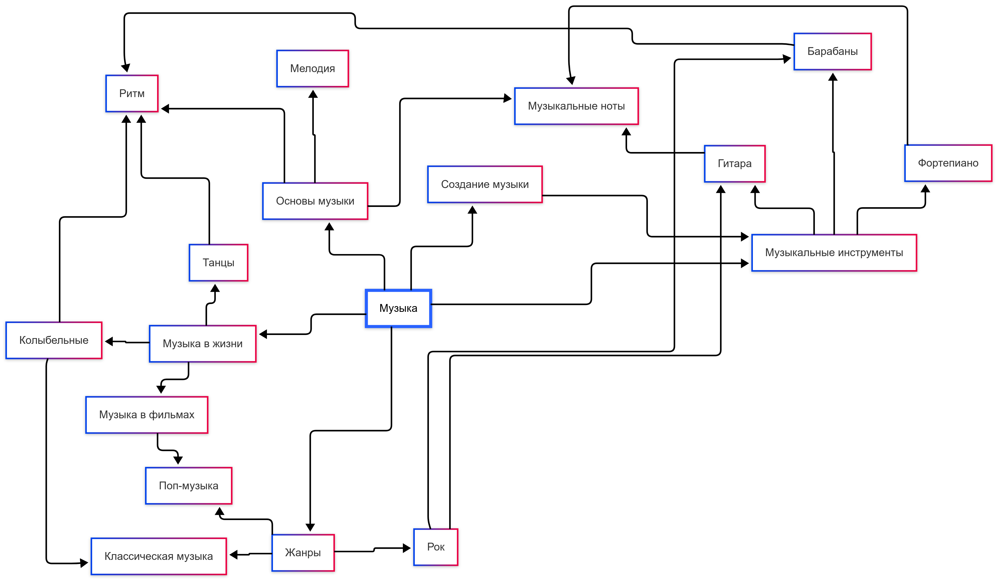

# Отчет по лабораторной работе

## Состав команды

| ФИО         | Что делал           | Оценка |
|-------------|----------------|--------|
| Клименко Виталий Максимович | Тема "Музыка в жизни" |      |
| Мозговой Никита Евгеньевич  | Тема: "Создание музыки"|     |
| Горохов Михаил Сергеевич    | Тема: "Основы музыки"|  |
| ...         | ... | |

## Концептуализация предметной области

С помощью ИИ, сгенерировали примерный план рассказа о нашей предметной области. Мы, конечно, немного опирались на него, но и много придумали своих тем, так как наша команда состоит по большей части из людей, непосредственно связанных с музыкой и ее созданием

## Написание текстов

### Искусственный интеллект
Для генерации текста использовался ИИ: кто-то пользовался приложенным [скриптом](./get_inf.py), кто-то копировал текст из диалогово окна. Для более разнообразных ответов использовались разные модели с одинаковыми промптами.

Помимо генерации самого текста, мы просили ИИ проставить ссылки на понятия из нашей и других тем кидбука.

### Натуральный интеллект
Текст, предложенный ИИ, не всегда был правдив и иногда был совсем несвязный однако это тоже было полезно, потому что этот текст подкидывал нам новых идей, которые иногда так трудно придумать

Данные сверялись с WikiData, Wikipedia и прочими источниками информации.

## Выводы

С какими сложностями столкнулись, какие решения применили, что получилось, что нет, что можно улучшить, ...
